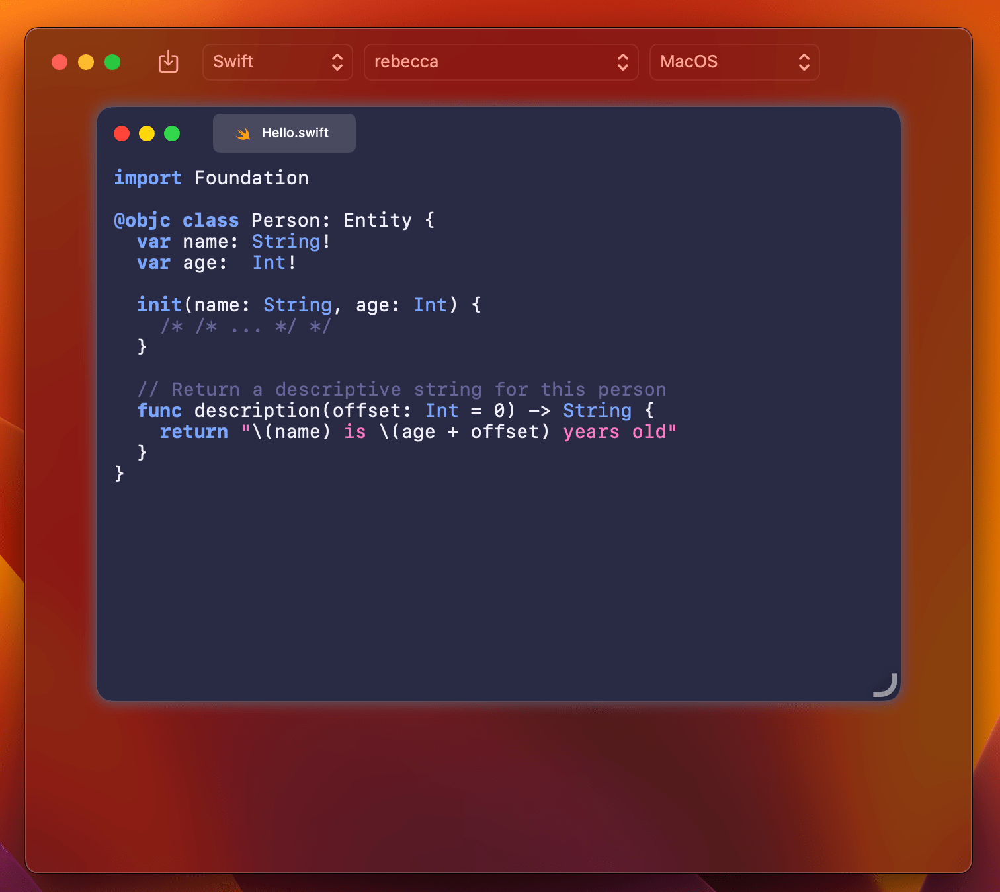

# Highlighter

Highlighter is an iOS & macOS syntax highlighter built with Swift. This library is forked of original [Highlightr](https://github.com/raspu/Highlightr) and combined with [Code Editor](https://github.com/ZeeZide/CodeEditor). Also it uses [highlight.js](https://highlightjs.org/) as it core, supports [185 languages and comes with 89 styles](https://highlightjs.org/static/demo/).

The real reason behind this fork is to use latest version of highlight.js and it's newer themes. You can show your highlighted string with CodeEditor or return it as a NSAttributtedString with proper syntax highlighting with the massive help of Highlightr.

## Preview

## Installation

### Swift Package Manager

The Swift package URL is: `https://github.com/Rminsh/Highlighter.git`

## Usage
See [Code Editor](https://github.com/ZeeZide/CodeEditor) and [Highlightr](https://github.com/raspu/Highlightr).

## JavaScript?

Yes, Highlightr relies on iOS & macOS [JavaScriptCore](https://developer.apple.com/library/ios/documentation/Carbon/Reference/WebKit_JavaScriptCore_Ref/index.html#//apple_ref/doc/uid/TP40004754) to parse the code using highlight.js. This is actually quite fast!

## Performance

It will never be as fast as a native solution, but it's fast enough to be used on a real time editor.

It comes with a custom made HTML parser for creating NSAttributtedStrings, is pre-processing the themes and is preloading the JS libraries. As result it's taking around of 50 ms on my iPhone 6s for processing 500 lines of code.

## License

This library is available under the MIT license. See the LICENSE file for more info.

Highlight.js is available under the [BSD license](https://github.com/isagalaev/highlight.js/blob/master/LICENSE).
Highlightr (iOS & macOS library) is available under the [MIT license](https://github.com/raspu/Highlightr/blob/master/LICENSE).
CodeEditor is available under the [MIT license](https://github.com/ZeeZide/CodeEditor/blob/main/LICENSE).
